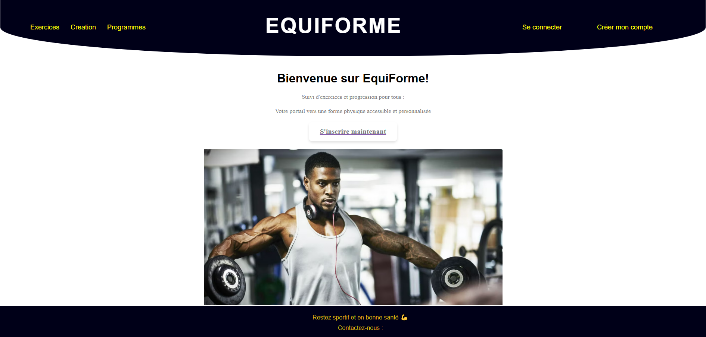
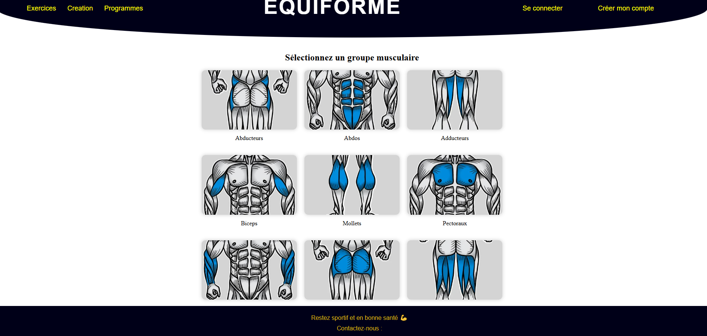
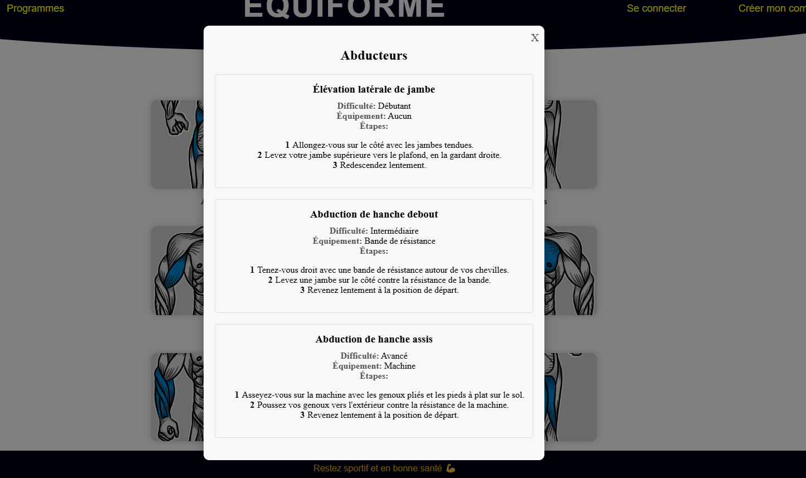

## Project Overview

This was my first major React project, developed collaboratively with a college classmate using the MERN stack (MongoDB, Express, React, Node.js). 
## Features Implemented

- **User Authentication:** Secure sign up and login system
- **Exercise Database:** Browse exercises organized by muscle groups
- **Workout Creation:** Build custom fitness plans and routines
- **Progress Tracking:** Monitor workout history and achievements
- **Responsive Design:** Mobile-friendly interface for on-the-go tracking

## Project Gallery

### Main Dashboard

*Main interface for workout management*

### Exercise Library

*Browse exercises organized by specific muscle groups*

### Exercice Details

*Interface for viewing the chosen muscle group's details*

