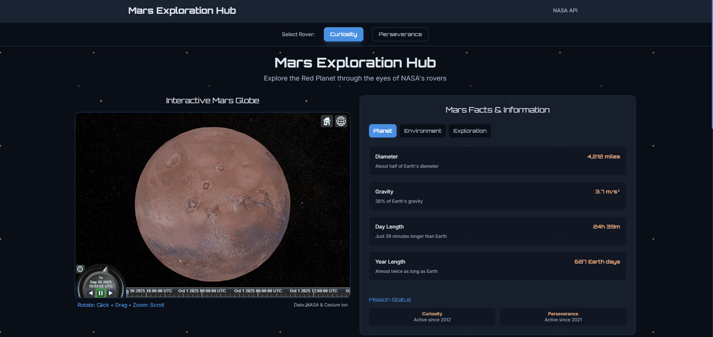
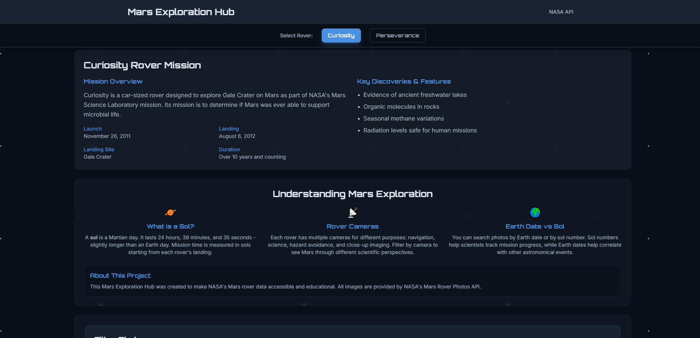
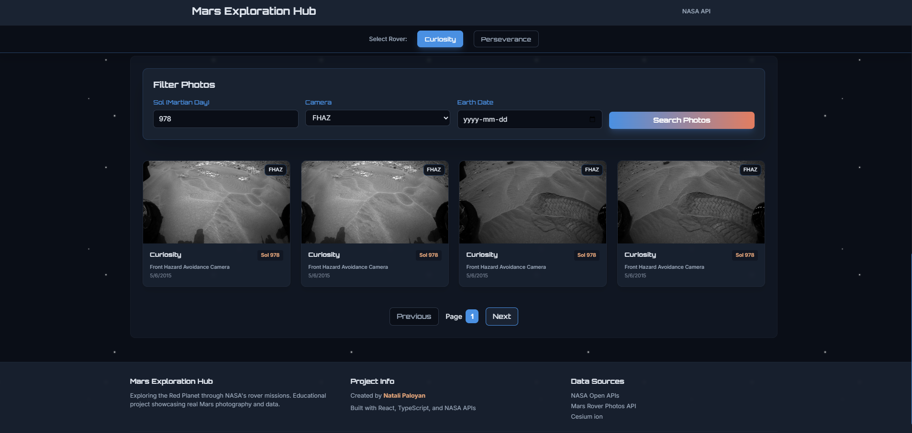
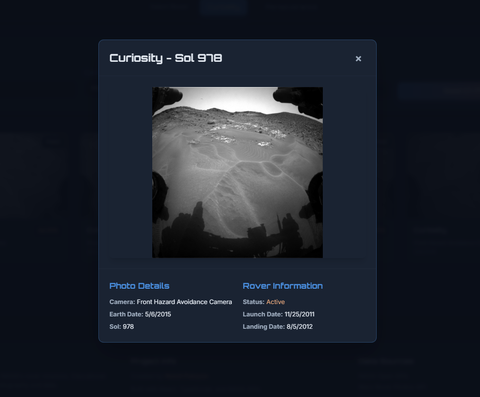

## Project Overview
As someone who has always been fascinated by astronomy and space exploration, I naturally gravitated towards creating a project that is related to our univers. The Mars Exploration Hub is an interactive web application that allows visitors to explore the Red Planet through the lens of NASA's rover missions, I intended for it to be educational.

**Live Demo:** [marsxplorationhub.vercel.app](https://marsexplorationhub.vercel.app/)

## Project Gallery

*Interactive 3D map of Mars using Cesium ion and information*

  

*Main dashboard showing rover selection and recent photos*

[View Source on GitHub](https://github.com/n4t4li/mars-gallery)