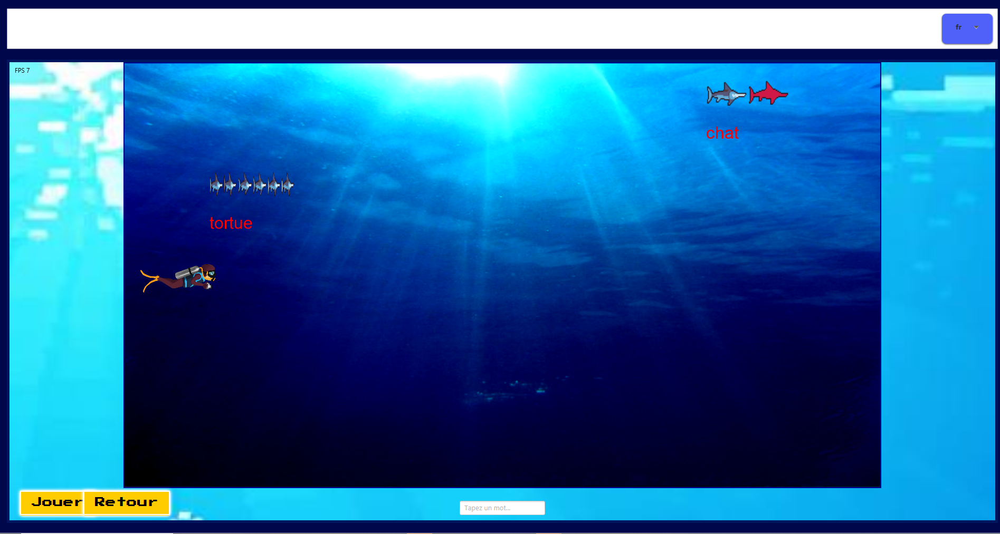

## Project Overview

Typer Shark is a fast-paced typing game where players must type words before time runs out. Built with JavaFX and the Ntro library, it features two main views: a tutorial page and a 2D canvas game interface with sharks moving toward a diver. The project includes comprehensive French translation functionality, making it accessible to both English and French-speaking users.

## Features Implemented

- **Start Game:** Initializes word list and countdown (1:00)
- **Validate Word:** +10 points for correct words, moves to next word
- **Skip Word:** Skip to next word but lose 10 seconds
- **Shuffle Words:** Randomize remaining word order
- **Pause/Resume:** Pause game without penalty
- **Lives System:** 3 lives initially, lost when timer reaches 0:00
- **High Score:** Saves best score
- **Game implementation on 2D canvas:** Real-time animations with sharks moving toward diver and dynamic word interactions
- **Bilingual Support:** Full French translation of all UI elements and instructions

## Project Gallery

### Tutorial Interface
   
*Tutorial page with game controls and instructions*

### Game Canvas

*2D canvas with sharks moving toward the diver*

### Game Demo Videos

<video controls width="100%">
  <source src="tutorialpage.mp4" type="video/mp4">
  Your browser does not support the video tag.
</video>
*Tutorial page functionality demonstration*

<video controls width="100%">
  <source src="canvasvideo.mp4" type="video/mp4">
  Your browser does not support the video tag.
</video>
*Gameplay showing sharks movement*

## Technical Details

**Platform:** Java with JavaFX  
**Graphics:** 2D Canvas for game animations  
**Architecture:** MVC pattern with message-based communication  
**Library:** Ntro framework for JavaFX applications  
**Localization:** Comprehensive bilingual support (English/French)

